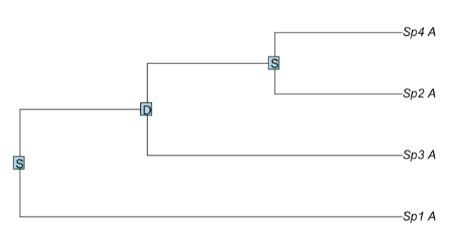
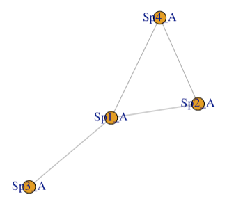
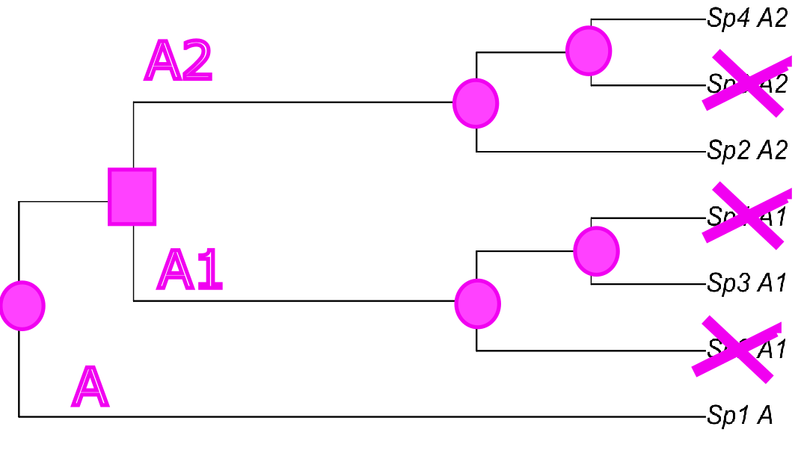

```{r, include = FALSE}
knitr::opts_chunk$set(
  collapse = TRUE,
  comment = "#>"
)
```

```{r, include = FALSE}
library(orthGS)
```

## What happen if I am interested in a gene family other than GS?

The **orthGS** package was developed to facilitate the study of orthology and paralogy relationships among 155 isoforms of the glutamine synthetase (GS) enzyme across 45 species of spermatophyte plants. It implements a tree reconciliation approach that maps gene/protein trees onto the corresponding species tree, with the goal of minimizing inconsistencies and identifying gene duplications, losses, and horizontal gene transfers. This method enables us to classify the relationship between two isoforms as either paralogy (if they diverged after a gene duplication event) or orthology (if they diverged after a speciation event). The key question we address here is whether the **orthGS** package can be use to study any gene family and any set of species. The short answer is yes, but certain conditions must be met.

* You will need to install RANGER-DTL on your machine (available at https://compbio.engr.uconn.edu/software/RANGER-DTL/). 

* Additionally, you will need to provide as input a rooted tree for the species of interest, as well as the gene/protein tree (either rooted or unrooted) that you wish to reconcile with the species tree.

## A toy example

Suppose we have 4 species whose phylogenetic relationships are very well established.

```{r}
plot(ape::read.tree(text = "(Sp1,(Sp2,(Sp3,Sp4)));"))
```

On the other hand, you have collected sequences for gene family A from these species. Using these sequences, you construct a gene/protein tree, which results in something like the following:

```{r}
plot(ape::read.tree(text = "(Sp1_A,(Sp3_A,(Sp2_A,Sp4_A)));"))
```

As is evident, the gene/protein tree does not mirror the species tree. The causes behind this discrepancy can be diverse:

* Methodological: sequence misannotation or misalignment, biased gene sequence sampling, inadequacy of the phylogenetic method used to construct the gene/protein tree, and so on.

* Biological: gene duplication, gene loss, horizontal gene transfer, incomplete lineage sorting, convergent evolution, and others.


It is the user’s responsibility to rule out any technical causes. Additionally, they should be aware of the potential biological sources of conflict between the gene and species trees. For the sake of this example, we will assume that the only remaining biological causes are gene duplication, gene loss, and horizontal gene transfer.

At this point, we are ready to infer the sequence of evolutionary events that reconcile the gene/protein tree with the species tree. To do this, we use the function `orthology()`.

The first argument, `trees`, specifies the path to a file containing both trees (species and gene/protein). The second argument, `invoke`, defines how the RANGER-DTL executable is called. Remember that you must have RANGER-DTL installed on your machine beforehand. For example, on macOS, you might set invoke = "Ranger-DTL.mac".

Optionally, you can adjust the default costs assigned to gene duplication (d), gene loss (l), and horizontal transfer (t) by specifying additional parameters (see the RANGER-DTL 2.0 Manual  at https://compbio.engr.uconn.edu/software/RANGER-DTL/).


```{r, eval=FALSE}
results <- orthology(trees = system.file("extdata", "input.trees", package = "orthGS"),
                     invoke = "Ranger-DTL.mac", plot = FALSE)
```

Since genes that diverge due to duplication (D) events are considered paralogs, while those that diverge due to speciation (S) events are considered orthologs, we will next plot the tree, highlighting these evolutionary events at the internal nodes.


```{r, eval=FALSE}
tr <- results[[1]]
for (i in 1:length(tr$node.label)){
  if (tr$node.label[i] == ""){tr$node.label[i] <- "S"}
}
plot(tr)
ape::nodelabels(text = tr$node.label)
```

{width=70%}

In this way, we can see that gene/protein A from species-3 is a paralog of those  from species-2 and species-4. In other words, we are not using orthologs to reconstruct the phylogeny of these species, which explains the discrepancy of this tree and the species tree we showed earlier. The **orthGS** package allows us to visualize these orthology/paralogy relationships even more explicitly, in the form of a graph:

```{r, eval=FALSE}
g <- results[[4]]
plot(g)
```

{width=70%}

As we already know, the gene/protein from species-3 is an ortholog only of that from species-1, but not of the genes/proteins from species-2 and species-4.

All this information has been summarized in the figure shown below, where speciation is represented by circles, duplication by squares and losses by crosses.

{width=70%}

If we wish to illustrate the sequence of evolutionary events—including speciation, gene duplications, and gene losses—in a single, publication-quality figure, we can proceed as described below. Please note that to run the following code, Python must be installed on the system, and the Python executable must be accessible via the system’s PATH.

First, re-run the `orthology` function, but this time set the parameter `saverec` to indicate the directory where a reconciliation file will be saved. This file need to be converted into a XML file using the script `ranger_to_recXML.py`.

The code shown in the next section is for guidance only. The parameters have been set based on the directory structure of my machine, so you may need to modify them to fit your setup.


```{r, eval=FALSE}
script_path <- system.file("python", "ranger_to_recXML.py", package = "orthGS")
path2rec <- system.file("extdata", "MyRec", package = "orthGS")
cmd <- paste("python3.11 ", script_path, " -i ", path2rec, " -o ./MyRec.xml", sep = "")
```

The MyRec.xml file returned by `ranger_to_recXML.py` can now be visualized using the program `thirdkind`, a nice utility for drawing reconciled phylogenetic trees, which can be reached at https://github.com/simonpenel/thirdkind/. Again the code show below is for guidance only.


```{r, eval=FALSE}
input <- system.file("extdata", "MyRec.xml", package = "orthGS")
output <- "./toyEx.svg"
cmd <- paste("thirdkind -f ", input, " -o ", output, sep = "")
system(cmd)
```


