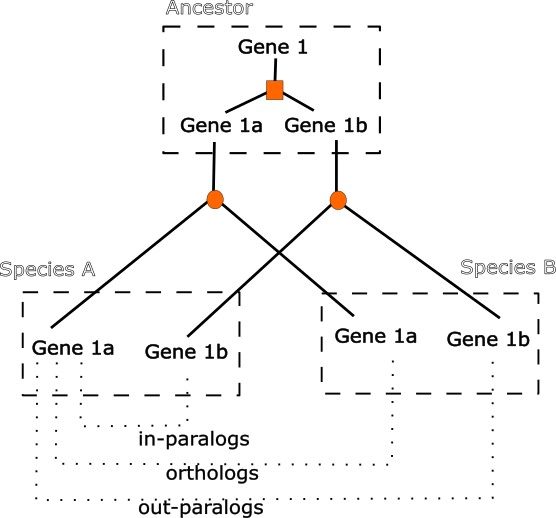
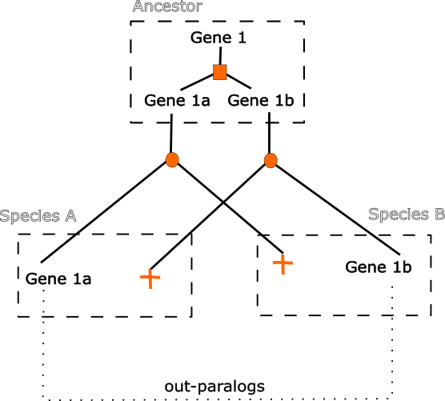
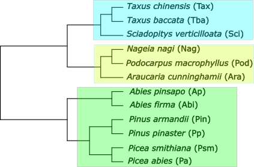
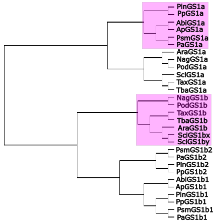
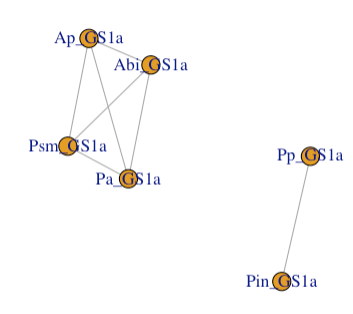
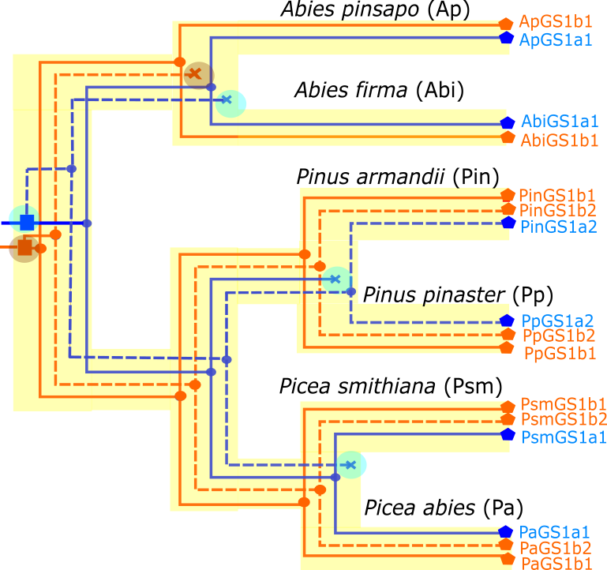
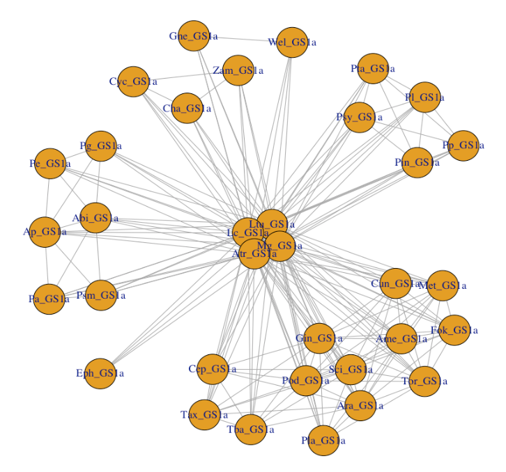

```{r, include = FALSE}
knitr::opts_chunk$set(
  collapse = TRUE,
  comment = "#>"
)
```

```{r,include = FALSE}
library(orthGS)
```

## Orthologs versus paralogs

The concepts of orthology and paralogy, accompanied by  precise definitions (see below), were introduced by Walter Fitch in a seminal paper published as early as 1970 [1]. Over the next three decades or so, the use and abuse (not infrequently misuse) of these terms gave rise to interesting discussions about the fruitfulness of such concepts [2-4], a debate in which Fitch himself took part [5]. 

Currently, in the post-genome era, with hundreds of genomes sequenced, there is little doubt of the usefulness, and I would even say necessity, of these concepts. Thus, as stated by Eugene V Koonin, a researcher at the National Center for Biotechnology Information (NCBI), "a clear distinction between orthologs and paralogs is critical for the construction of a robust evolutionary classification of genes and reliable functional annotation of newly sequenced genomes" [6].

Before adding anything else, let's remember the original definitions of homology, orthology and parlogy in the context of gene/protein evolution.

Homology
: Refering to genes (or proteins), that are descended from a gene (or protein) present in a common ancestor. 

Orthology
: Genes or proteins separated (that have diverged) by speciation events are called orthologs.

Paralogy
: Genes of proteins separated (that have diverged) by duplication events are called paralogs.


A common misconception is that paralogous genes must always exist within the same genome or species, although the definition does not impose such a restriction. This misunderstanding may stem from the fact that, when paralogs first arise through gene duplication, both copies naturally coexist within the same genome (Figure 1). However, as evolution proceeds, these paralogs are not necessarily confined to the same genome or organism.

&nbsp;

{width=50%}

&nbsp;

Along time, gene families expand (gene duplication) and contract (gene loss), and we can end up finding paralogs in different species. Sometimes, these paralogs are easy to recognize. For instance, multiple homologs in the same genome will always be paralogs. However, many other times paralogs are easy to confuse with orthologs (Figure 2). 

&nbsp;

{width=50%}

&nbsp; 

One last general cautionary note before we move forward and jump into the specifics of the GS evolutionary history in gymnosperms. Another misconception that we often find in the literature is related to the use of the term 'ortholog' for proteins present in different species but fulfilling the same function, while in these misleading context, the term 'paralogs' is reserved for proteins found in the same species but performing different functions. However, as pointed by Jensen [4]: "Although plenty of examples exist for which this evolutionary scenario has indeed played out, it is quite possible for orthologs to acquire different catalytic (or regulatory) properties and for paralogs to retain the same function". In fact, recent data suggests that this last possibility occurs very frequently [7].

## Glutamine synthetase from conifers

The enzyme glutamine synthetase (GS, EC 6.3.1.2) catalyzes the incorporation of ammonium to glutamate to form glutamine in an ATP-dependent fashion. This enzyme plays a crucial role in plant nitrogen assimilation, being responsible for up to 95 % of the ammonium assimilated in plants.

Conifers present two well differentiated families of cytosolic GS isoforms: GS1a, mainly expressed in photosynthetic tissues, and GS1b being relevant in nonphotosynthetic tissues. These GS1 lineages have been detected in all gymnosperms as well as in basal groups of angiosperms [8]. In general, GS1a is encoded by a single gene (locus). In contrast, it is not uncommon to find different loci contributing to the variability of GS1b, both in gymnosperms and angiosperms, although in a much more pronounced way in the latter.   

To illustrate the points we aim to develop and expose in the current vignette, we have selected 12 conifer species whose phylogenetic relationships are well established (Figure 3). 

&nbsp;

{width=50%}

&nbsp; 

Together, these species present 29 GS isoforms: 12 GS1a proteins (one per species) and 17 GS1b proteins (Figure 4).

Next, we point a few instructions to plot both the species and protein family trees using the data included into the orthGS package.

```{r, eval=FALSE, include=TRUE}
# Plot species tree:
str <- ape::read.tree(text = "((((Pa,Psm),(Pp,Pin)),(Abi,Ap)),((Ara,(Pod,Nag)),(Sci,(Tba,Tax))));")
plot(str)
# Load GS sequence data:
agf <- agf 
# Aligning sequences and building an unrooted tree 
# (remember you need the MUSCLE software in your path):
conif <- agf[which(agf$short %in% str$tip.label), ]

# Depending on whether you have the MUSCLE software in your path or if you choose 
# the R package muscle, you will follow either chunk (A) or (B). 
# If you select path A, uncomment it and comment out chunk B

## --- Option (A): when MUSCLE software is in your path
# ptr <- mltree(msa(sequences = conif$prot, 
#                   ids = conif$phylo_id, 
#                   inhouse = TRUE)$ali)$tree
## --- Option (B): when we chose to install the R package muscle:
# First the alignment:
aln <- msa(sequences = conif$prot, ids = conif$phylo_id)$ali
rownames(aln) <- conif$phylo_id
# Then, the tree:
ptr <- mltree(aln)$tree

# Regardless the way followed (either A or B), we now root the tree:
ptr <- madRoot(ptr)
plot(ptr, use.edge.length = FALSE, cex = 0.6)
```


&nbsp;

{width=50%}

&nbsp;
 
As it is evident from previous figures, there are some conflicts between the well established species tree (Figure 3) and the GS protein tree (Figure 4) we have built. For instance, the genus Picea is sister to the genus Pinus, however GS1a from Picea species are more closely related to the GS1a from Abies than Pinus, which obviously demands reconciliation!

When we look at the genomes of these 12 conifer species, we find that GS1a is a single-copy gene. That is, each species has one and only one GS1a gene. We could naively think that GS1a is a good gene to infer the phylogenetic relationships of these species. However, we have seen that this is not the case. The reason for this is that we have assumed that the 12 GS1a proteins we have been analyzing are orthologs, when in reality, as we shall see below, we have a mixture of orthologs and paralogs.


### Phylogenetic reconciliation

In phylogenetics, reconciliation is the term used to encompass a wide and varied range of inference techniques that aim to find the historical events (gene duplication, transfer, loss, etc.) that best explain the inconsistencies between gene tree and species tree. Although many approaches have been developed in the last few years (see [9] for a review), the one implemented in the **orthGS** package is the method described in [10], which is based on the parsimony principle: the best gene/protein family history is the history with the fewest events. 

We will focus in the six species belonging to the order Pinales (green rectangle from Figure 3), whose phylogenetic relationships seem to be in conflict with that suggested in the protein tree (Figure 4, top pink rectangle). So, let's start by collecting the relevant data regarding the GS isoforms present in this set of species:

```{r}
data <- subsetGS(sp = c("Ap", "Abi", "Pin", "Pp", "Psm", "Pa"))[, 2:9]
data$phylo_id
```

We can check that there are 16 forms of GS: 6 GS1a proteins (one per species) and 10 GS1b isoforms. Next, we are going to plot the orthology network for this set of proteins. For this purpose we will use the function `orthG` that will take as argument the set of species that interest us: 

```{r,  eval=FALSE, include=TRUE}
o <- orthG(set = c("Ap", "Abi", "Pin", "Pp", "Psm", "Pa"))
A <- o[[1]] # Adjacency matrix
g <- o[[2]] # igraph object (orthology network)
```

It should be noted that the function `orthG` returns a list with two objects. The first one is an adjacency matrix. In our case a square matrix of order 16  whose entries are 1 for orthology or 0 for paralogy. The second element of the returned list is an igraph network. 

If desired, we can plot a subnetwork indicating the nodes of interest. For instance, let's focus our interest on GS1a:

```{r include=FALSE}
g <- orthG(set = c("Ap", "Abi", "Pin", "Pp", "Psm", "Pa"))[[2]] 
```


```{r, eval = FALSE}
gs1a <- data$phylo_id[grepl("GS1a", data$phylo_id)] # selected nodes
plot(igraph::subgraph(g, vids = gs1a))
```


&nbsp;

{width=50%}

We observe that GS1a isoforms from the genus Pinus are paralogs of the GS1 from the genus Picea and Abies. On the other hand, all the GS1a from Picea and Abies are orthologs among them. In this way, the phylogenetic relationships inferred for the GS1a proteins from Pinales (Figure 4), are reconciled with the phylogenetic tree of the species (Figure 3). Furthermore, the sequence of evolutionary events leading to such a reconciliation can be inferred and plotted (Figure 5)

&nbsp;

{width=50%}


## GS1a orthology network beyond conifers

As mentioned, GS1a is an isoform described to be present not only in all gymnosperms, including Aracaurales, Cupressales, Pinales, Gnetales, Ginkgoales and Cycadales, but also in basal angiosperms such as species from the orders Amborellales and Magnoliales. 

The data included in the **orthGS** package cover 34 GS1a proteins from as many species. 

```{r, eval=FALSE, include=TRUE}
data <- sdf
gs1a <- data[which(data$gs == "GS1a" & data$tax_group != "Ferns"), ]
```

This parity between the number of proteins and the number of species is rather misleading, since it might induce us to think that all these proteins are orthologs and that they have diverged exclusively due to speciation processes. However, if we plot the orthology network inferred by tree reconciliation, the picture is quite different: gene duplication within the GS1a lineage is frequent, but unlike the case of the GS1b lineage, GS1a duplications seem to be balanced by losses.  

```{r, eval = FALSE, include = TRUE}
o <- orthG()
g <- o[[2]]
plot(igraph::subgraph(g, vids = gs1a$Sec.Name_))
```

&nbsp;

{width=50%}

&nbsp;


It would be interesting to investigate in the future whether this balance between duplications and losses responds to selective forces or if, on the contrary, it can be explained based on the stochastic nature of these processes.


## References

1. Fitch WM. Distinguishing homologous from analogous proteins. *Syst Zool* 1970, **19**:99-113.
2. Petsko GA. Homologuephobia. *Genome Biol* 2001, **2(2)**:comments1002.1-1002.2.
3. Koonin EV. An apology for orthologs - or brave new memes. *Genome Biol* 2001, **2(4)**:comments1005.1-1005.2.
4. Jensen RA. Orthologs and paralogs - we need to get ir right. *Genome Biol* 2001, **2(8)**:interactions1002.1-1002.3.
5. Fitch WM. Homology. A personal view on some of the problems. *Trends in Genetic* 2000, **16**:227-231.
6. Koonin EV. Orthologs, paralogs, and evolutionary genomics. *Annu Rev Genet* 2005, **39**:309-338.
7. Stamboulian M, Guerrero RF, Hahn MW, Radivojac P. The orgholog conjecture revisited: the value of ortholgs and parlogs in function prediction. *Bioinformatics* 2020, **36**:i219-i226.
8. Valderrama-Martín JM, Ortigosa F, Cantón FR, Ávila C, Cañas RA, Cánovas FM. Emerging insights into nitrogen assimilation in gymnosperms. *Trees* 2024, **38**:273-286.
9. Menet H, Daubin V, Tannier E. Phylogenetic reconciliation. *PLoS Comput Biol* 2022, *18*(11): e1010621.
pcbi.1010621.
10. Bansal MS, Kellis M, Kordi M, Kundu S. RANGER-DTL 2.0: rigorous reconstruction of gene-family evolution by duplication, transfer and loss. *Bioinformatics* 2018, **34**:3214-3216.
